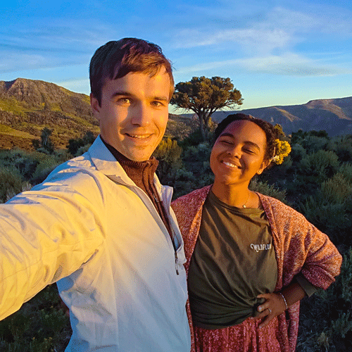

# About

We make tools for business. We analyze data and deliver it to your website via our APIs:

* \*\*\*\*[https://rapidapi.com/user/nlp-studio](https://rapidapi.com/user/nlp-studio)  
  **Most accurate synonyms**, ****parts of speech, word info, and sentiment analysis.

  **Best domain name suggestions** - most relevant, short, memorable, and available.

We also make websites and apps: 

* [https://**nlp.domains**](https://nlp.domains) **** Find an available domain name for your business
* [https://**nlpthesaurus.com**](https://nlpthesaurus.com) **** Thesaurus, word information, word sentiment

## Who we are

A husband and wife team, based in Kansas City, MO \(USA\). 👨🏼‍💻👩🏽‍💼Combining our talents, we were able to make the world's best English language thesaurus. Paul built some advanced custom admin tools. Samira used them to comb through and edit thousands of words. 

**Paul Shorey** \([paulshorey.com](https://paulshorey.com)\)   
has been making websites and apps for 12 years. JavaScript, UI design, front-end, back-end, systems and databases. Paul has a BFA in fine art, but has embraced software development as his art medium of choice. Developing is a creative process, and very powerful. When not coding, he enjoys building light fixtures, growing microgreens, and doing adventure sports.

**Samira Ali**   
has a Bachelors in Sociology. She has worked at several non-profits, and has started many of her own initiatives. She has worked in tech and medicine as well. She speaks several languages, and has been a part of a very diverse range of cultures. She is now starting medical school, to be a doctor, but will still be around to give guidance and direction in the areas of language, user perception, and design.

We're both inspired by our upbringing and by the crazy adventure that is life. Paul immigrated from Russia, and Samira is a refugee from Africa. We're thankful for where we are now, and are moving toward securing a prosperous future through hard work and the pursuit of excellence. Looking forward to meeting you. [Let's get in touch](funny-suggestions.md) \(virtually\).

## Why NLP?

It stands for Natural Language Processing \(or Neuro Linguistic Programming\). A branch of AI. Paul has worked at an AI company for the last 2 years before starting this. This venture, however, is not as ambitious as many AI companies. We're not trying to change the world or create sentient software.

The reason this happened, is because in 2019, Paul set out to make a domain name suggestions app. Unfortunately, he was disappointed with the quality of publicly available APIs and datasets. Thesaurus sources were not reliable, or did not have an API. So, he set out to make his own. He got carried away, and accidentally made the best English thesaurus in the world. 

It was a great learning experience, and now we have a database of 500,000 words, about 200,000 of which have good synonyms. As a reference, a native English speaker knows from 20,000 to 35,000 words, including slang. Many of the others are medical terms. We're currently brainstorming how this can be used in medical applications - perhaps to refine search results in sites like WebMD. 

For now, our focus is domain names. Visit [nlp.domains](https://nlp.domains) or try [the API](https://rapidapi.com). Our program generates hundreds of name phrases, and pairs them with the most relevant TLDs \(extensions\). There are currently 1000+ new TLD extensions which people don't even know exist, so this service is very useful. We then check for the status \(availability\) of each domain name. No more typing in one domain name at a time, and hoping that it's available. Our app gives you hundreds of similar names. Some of them turn out to be available and pretty good!

## This is all a work in progress

Our products were just published in July 2020. If you find anything broken, [please let us know](funny-suggestions.md). If you would like a feature or have any advice for us at all, please [contact us](funny-suggestions.md).

This venture is long-term. We'll continue to support it as long as we have customers. It may take years to become successful. That's ok. This is a labor of love.

Please try our APIs, and compare to other providers. You will not be disappointed. 

If our APIs are not as good as what you're currently using, [please let us know](funny-suggestions.md). Thank you for your support and feedback!

